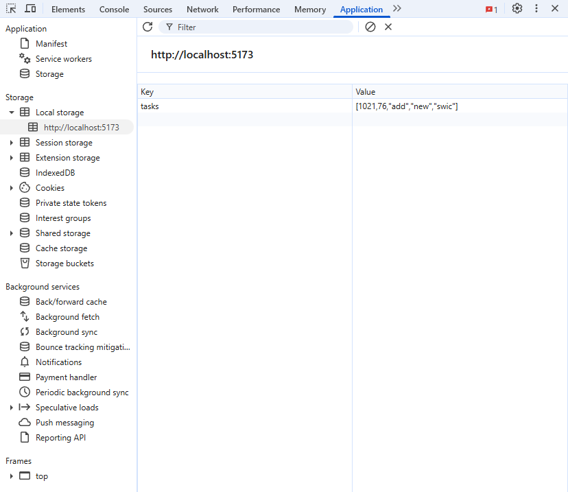

# Nick Nolden

## 12-3 Reflection

### Questions

- What localStorage key did you use for your todos?

  - Like last time, my localStorage key is `tasks`.

- How did you structure each todo object? (e.g., just a string? an object with id and text?)

  - Each todo object is a JSON parsed one, but it falls back to a plain ol' string if the parsing fails.

  - ```js
    try {
        // try to parse JSON input (arrays, objects, numbers, booleans, etc.)
        newItem = JSON.parse(inputTrimmed);
    } catch {
        // if not valid JSON, keep as plain string
        newItem = inputTrimmed;
    }
    ```

- Open Developer Tools (F12), go to Application → localStorage, and take a screenshot showing your saved todos. Paste that screenshot in your reflection.

  - 

- Explain what useEffect is doing inside the useLocalStorage hook. Why is it necessary?

  - `useEffect` saves whatever we give it (in this case, our tasks) to `localStorage`. This is necessary because React's main job is to update the UI based on the current state of the app. Using `useEffect` allows us to do necessary things, like saving to `localStorage`, after React is done updating the UI.

- When the user clicks "Add," which function runs first: the component's state setter or the useEffect?

  - The component's state setter runs first because `useEffect` runs after React updates the state.

### useEffect is **Not** a Magic Solution for Everything

`useEffect` sounds like it a great thing we should use all the time when we need to access something outside of React. However, that is not actually the case. Matter of fact, [you don't even need to use them](https://react.dev/learn/you-might-not-need-an-effect) most of the time. `useEffect` is a powerful tool, but it should only be used when it is absolutely needed. Saving things to `localStorage` is a good example of when you should use. Using `useEffect` for mundane things, like button clicks, input changes, or even handling the state, is completely unnessicary. `useState` exists for a reason. We should use that instead of `useEffect` for the state, or a custom hook that uses `useState`. Button clicks can simply use the `onClick` prop, and [`onChange`](https://react.dev/reference/react-dom/components/input) can be used for other input things.

### Things to Remember for Custom Hooks

Whenever you make a custom hook you should always start its name with `use` then the rest of the name (ie `useLocalStorage`). This tells React, along with every other developer on your team, that this is a hook. If you leave out `use`, it'll cause confusion, and worse, people using it like any other function.

Another thing to keep in mind is that you should never use a hook inside of a conditional thing, like an `if` statement. Doing it like that can cause the hook's call order to change every render. If you need to use conditionals, call the hook first, and then use the `if` statement.

```js
const [value, setValue] = useState(0);
if (!show) return null;
```

Lastly, you should avoid writing your hook calls that can cause an infinite render loop to occur. For example, if you tell your hook to update every time an array changes its length, it will make the state rerender for eternity (or until you run out of memory).

### Our First Custom React App

While this wasn't required as part of the reflection, I figured I'd talk about it anyway just to be safe.

As part of this assignment, we were also required to make a custom React app that also took advantage of `localStorage`. I decided to essentially remake that one thing I made in Tailwind's playground all the way back in 177, where if you clicked a button, it went from red to green, and it would stay that way until you clicked it again. I figured having the button states stay where they are with `localStorage` would be a fine addition to such a little toy. I did have some challenges along the way though, so let's dive in.

One of the first challenges was trying to think of a way to keep track of the state for each individual button. I decided to do a web search to see what I could do, and I found out I could keep track of a button's state by giving it a boolean, so I went ahead and made that. I did ask Copilot to modify it, along with a const arrow function that modifies the state (`handleButtonClick`), to include `localState` functionality using `useLocalState` (the one I copied in from the lesson). The biggest flaw with my setup is that each individual button needs to have a state, so all the buttons, 1-16, had to be given true/false booleans. Along with that, I added each button in manually with copy and pasting, with minor modifications so they would affect the state that it needs to affect. If this sounds incredibly tedious, it is. To keep things less painful for myself, I stuck with a 4x4 plane of buttons. I'm sure there's a better way of doing what I did, like making each state and/or button dynamically so I could keep the code a lot more clean, and not to mention make the plane bigger. What I have though still works, so I can't complain much.

Another "fun" thing I dealt with was that Tailwind was just not working at all for some reason. Like I added in their classes and the stylings would not change on the browser side. I ended up doing things the old fashioned way and adding in styles to `App.css`, with some help from Copilot to speed things along, and with adding some things I forgot the name to. Honestly though, doing it this way turned out to be a happy accident, as it helped keep the `className` portion of each button a lot smaller than it would be with Tailwind classes. While it would've been nice to have Tailwind working, doing things the old fashioned way was a nice change of pace.

The last challenge I dealt with was dark mode. The css stylings that came with the repo already had some things set up with it, which made the white text invisible on the white play field. So with the help of Copilot, I made it so the play field would have a dark background color in dark mode. Not only did it make the text readable again, but I also preferred how the stylings looked on there compared to light mode.

Working on this app, while a bit challenging and frustrating at points, was a fun little throwback for me. Making an old Tailwind playground app an actual React app feels rewarding in a way.

The app can be seen on the [`button-state`](https://github.com/swic-web-dev-fs-2025/react-local-storage-NN125/tree/button-state) branch of this repo.
